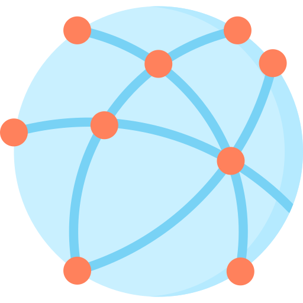

<div align="center">

</div>

<p align="center"><span><b>Network Debug Assistant</b> - UDP, Websocket, SocketIO</span></p>

<div align="center">

[](https://github.com/kuyoonjo/nda/releases)[](https://github.com/kuyoonjo/nda/releases)

</div>

<div align="center">

[](https://opensource.org/licenses/MIT)

[](https://github.com/kuyoonjo/nda/releases/latest)


</div>
<div align="center">


</div>

## Screenshot


## Installation

Download the installer for your operating system [on the release page](https://github.com/kuyoonjo/nda/releases).

## Run Locally

Clone the project

```bash
  git clone https://github.com/kuyoonjo/nda.git
```

Go to the project directory

```bash
  cd nda
```

Install dependencies

```bash
  pnpm install
```

Note : Follow [this guide](https://tauri.studio/en/docs/getting-started/intro/#setting-up-your-environment) to set up Tauri environment

Start the server

```bash
  pnpm tauri dev
```
